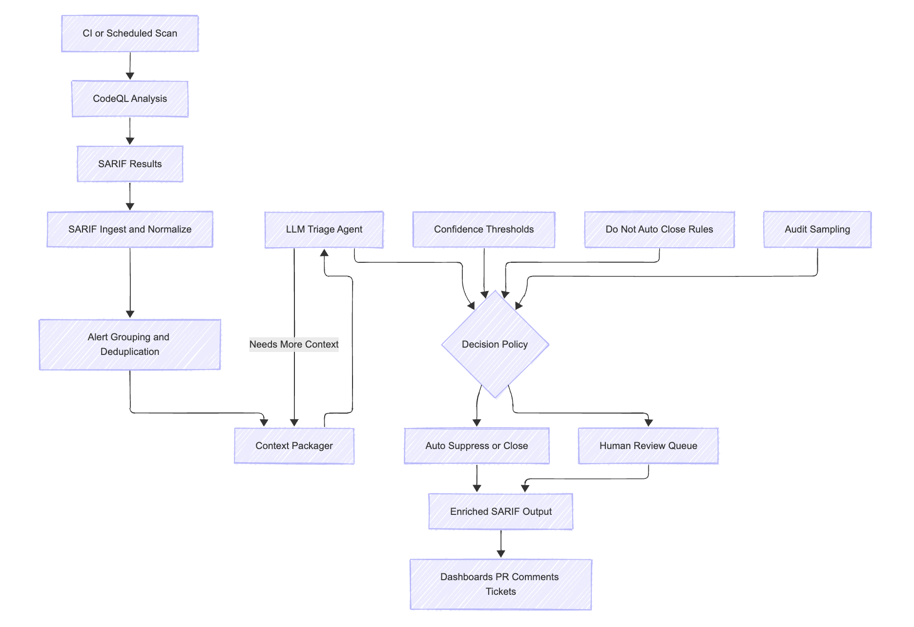

Cutting Security Alert Noise with SLM — see [benchmark/README.md](benchmark/README.md) for RQ1 CodeQL-only runs (local Qwen + optional OpenHands).

## Report
- Paper: https://arxiv.org/pdf/2601.22952v1
    - Summary:
        - Problem addressed
            - Static Application Security Testing (SAST) tools generate large numbers of false positives (FPs), creating heavy manual triage overhead for developers.
        - Core idea
            - Evaluate whether LLM-based agent frameworks can more effectively filter SAST false positives compared to simple (vanilla) prompting approaches. 
        - Agent frameworks studied
            - Aider
            - OpenHands
            - SWE-agent
            - These agents differ in how they perform iterative reasoning, tool usage, and interaction with code and execution environments. 
        - Datasets and benchmarks
            - OWASP Benchmark vulnerabilities
            - Real-world open-source Java projects, including CodeQL alerts. 
        - Key quantitative results
            - On OWASP Benchmark:
                - Initial FP rate of >92% reduced to as low as 6.3% with the best agent configuration. 
            - On real-world projects:
                - Best configuration achieves up to 93.3% FP identification rate for CodeQL alerts. 
        - Model backbone dependence
            - Agentic approaches significantly outperform vanilla prompting when paired with stronger LLM backbones (e.g., Claude Sonnet 4, DeepSeek Chat (vanilla prompting already achieves low FPR), GPT‑5).
            - Gains are limited or inconsistent for weaker backbone models. 
        - Vulnerability-type effects
            - Effectiveness varies by CWE category; some vulnerability classes benefit much more from agent-based reasoning than others. 
            - residual FPs are concentrated in a few categories, particularly CWE-327 (Weak Cryptography), CWE-330 (Weak Randomness), and CWE614 (Secure Cookie Flag), while injection-style vulnerabilities (e.g., CWE-78, CWE-79, CWE-89) are filtered almost completely
        - Trade-offs identified
            - Aggressive FP filtering can suppress true positives, introducing a recall vs. precision trade-off that must be carefully managed. 
        - Cost considerations
            - Large disparities in computational cost across agent frameworks; more sophisticated agents often incur substantially higher execution cost. 
        - Main takeaway
            - LLM-based agents are powerful but non-uniform solutions for SAST false positive filtering.
            - Practical adoption requires careful tuning of agent design, LLM backbone choice, vulnerability category, and cost constraints
    - High-level Archicture Diagram

        

- OWASP Top 10: 2025 - Target Vulnerabilities:
    - A01:2025 Broken Access Control
    - A05:2025 Injection

- Benchmark dataset: https://owasp.org/www-project-benchmark

- Initial plan
    - Use CodeQL to generate initial alerts - SARIF output
    - SLMs: Qwen3 (4B, 8B, 14B), DeepSeek-Coder-V2-Lite (16B), Qwen 2.5 Coder (14B) - specialized for security code analysis.
    - Triage with Agents using these SLMs: An AI agent using the SARIF parser to read CodeQL outputs and feed relevant code snippets to an SLM to filter 
    - Benchmark
    
- Other tools (exploration):
    - https://github.com/psyray/oasis
        - Ollama Automated Security Intelligence Scanner
        - An AI-powered security auditing tool that leverages Ollama models to detect and analyze potential security vulnerabilities in your code.
    - https://github.com/OpenHands/OpenHands
    
    - https://openai.com/daybreak/
        - scan -> patch -> validate
        - deploy inside codex security
        - proprietary tool

- Questions:
    - how is the current workflow?
        - CodeQL Scan -> run SLM/Agentic Scan -> manual review?
    - input to codeQl? - multiple files
    - the benchmark numbers?
    - deployment?
        - need to create a stack (cloud formation) to integrate
        - where to deploy SLMs? - 
            - need to be hosted in the same env 
            - what inferencing tech?
        - fine tuning?
    - Are we expected to predict CWE? Not really
    - Classes: 
        - Bayer policy, 
        - TP, 
        - FP 
        - Boarderline TP/FP -> TP
        - etc.
    - languages
        - NodeJS is most prominant
        - JAVA, GO are the other languages
    - Richa to provide a sample CodeQL output as input to our solution
    - timeslot for recurring meeting

---
## Deploying and Running Qwen3 Inference via Unsloth on AWS EC2

This document provides a comprehensive guide for setting up an isolated GPU environment on AWS EC2, connecting to it securely via Cursor/VS Code, and running optimized inference using Unsloth on original Qwen3 model sizes.

### 1. Cloud Architecture & Infrastructure Choice
Recommended Instance Spec

* Instance Type: g6e.[X]xlarge
* GPU: 1x NVIDIA L40S Tensor Core (48GB VRAM)
* System Memory: 64GB RAM
* Storage: >= 100 GB (gp3 EBS volume) to comfortably accommodate multiple model weights.
* Operating System / Image: Deep Learning AMI GPU PyTorch 2.5+ (Ubuntu 22.04) (highly recommended to avoid manual CUDA and NVIDIA driver installation headaches).

Subnet and Routing Requirements

To prevent terminal connection dropouts, ensure the instance is provisioned within a Public Subnet possessing:

1. An explicitly assigned Public IPv4 address (or an attached Elastic IP).
2. A Subnet Route Table routing outbound traffic (0.0.0.0/0) through an Internet Gateway (igw).

### 2. Connect Locally via SSH
Open your local terminal and run these commands to configure permissions and connect:
```bash
# Set secure permissions for your private key
chmod 400 /path/to/your-key.pem

# Connect to the instance
ssh -i /path/to/your-key.pem ec2-user@<YOUR-INSTANCE-PUBLIC-IP/FQDN>
```

### 3. Remote Development Setup (Cursor / VS Code)
Using a remote IDE bypasses terminal limitations and allows file synchronization over SSH.

- Step 1: Install Extensions
Open Cursor / VS Code locally, navigate to the Extensions Market (Ctrl+Shift+X), search for Remote - SSH (by Microsoft), and install it.

- Step 2: Configure Host Access
Open your Command Palette (Ctrl+Shift+P or Cmd+Shift+P), choose Remote-SSH: Open SSH Configuration File..., and select ~/.ssh/config. Append the following host metadata structure:
```conf
Host qwen-ec2
    HostName <YOUR-AWS-EC2-PUBLIC-IP-ADDRESS>
    User ec2-user
    IdentityFile "/path/to/your/sast-aws-ec2.pem"
```
- Step 3: File Deployment

    1. Click the Green/Blue Remote Status Indicator in the absolute bottom-left corner of Cursor, select Connect to Host..., and click qwen-ec2.
    2. Select File > Open Folder and accept the default path /home/ec2-user.
    3. Workspace Upload: Drag and drop your local repository folder from your local desktop file manager directly into the left-hand Cursor file tree explorer interface.

    4. Executing Qwen3 Optimized Inference
Unsloth enables 4-bit quantization layout profiles to drastically lower hardware overhead.
Recommended Model Mapping (48GB VRAM Ceiling)


### 4. Python Experiment Script (run_qwen3.py)

Create this file within your project directory inside the Cursor editor pane:
```python
import torch
from unsloth import FastLanguageModel

# ==================== CONFIGURATION ====================
# Select from available Unsloth Qwen repositories:
# Options: "unsloth/Qwen3-4B-Instruct-bnb-4bit", "unsloth/Qwen3-8B-Instruct-bnb-4bit", "unsloth/Qwen3-14B-Instruct-bnb-4bit"
MODEL_NAME = "unsloth/Qwen3-4B-Instruct-bnb-4bit" 
MAX_SEQ_LENGTH = 4096  
LOAD_IN_4BIT = True    

print(f"Initializing model mapping for: {MODEL_NAME}...")

# Load Model & Fast Tokenizer
model, tokenizer = FastLanguageModel.from_pretrained(
    model_name = MODEL_NAME,
    max_seq_length = MAX_SEQ_LENGTH,
    dtype = None,             # Auto-detects system specifications (bfloat16 preferred)
    load_in_4bit = LOAD_IN_4BIT,
)

# Apply Unsloth's native runtime optimization wrapper for 2x faster inference
FastLanguageModel.for_inference(model)

# ==================== INFERENCE RUN ====================
messages = [
    {"role": "user", "content": "Explain the difference between a private and a public subnet in cloud architectures."}
]

inputs = tokenizer.apply_chat_template(
    messages, 
    tokenize = True, 
    add_generation_prompt = True, 
    return_tensors = "pt"
).to("cuda")

print("\n--- Compiling & Executing Generation Pipeline ---")
with torch.no_grad():
    outputs = model.generate(
        input_ids = inputs, 
        max_new_tokens = 512, 
        use_cache = True,
        temperature = 0.7,
        top_p = 0.9
    )

response = tokenizer.decode(outputs, skip_special_tokens=True)
print("\n[MODEL OUTPUT]:\n", response)
```

### Running Experiments Safely
Open the remote terminal inside Cursor (Ctrl + ` ) and trigger persistent execution via tmux so scripts don't crash if your network drops:
``` bash
# Start a persistent runtime terminal container
tmux new -s inference_session

# Activate virtual environment
source /home/ubuntu/unsloth_env/bin/activate

# Execute inference script
python run_qwen3.py
(To detach from tmux, press Ctrl+B then D. To resume your session later, type tmux a -t inference_session).
```
### 5. Operational Maintenance & Monitoring
To audit VRAM footprint allocations dynamically while evaluating different model sizes, split your terminal screen or connect to a separate concurrent terminal shell and run:
```bash
watch -n 0.5 nvidia-smi
```