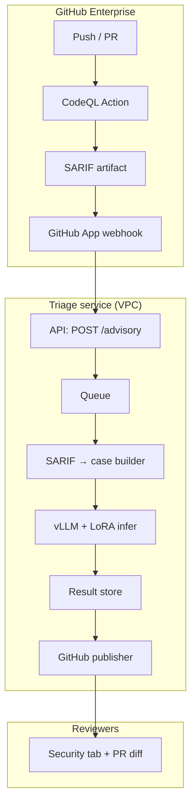

# GitHub Enterprise — Advisory CodeQL Triage Plug-in

**Status:** Planned (implement after Phase 3 completes)  
**Prerequisite:** Phase 3D global best checkpoint + test eval (`runs/phase3/stage3d/lora/best`)  
**Mode:** Advisory only — annotate CodeQL findings; humans dismiss/fix in Security tab

---

## Problem statement

Enterprise teams run CodeQL on every push/PR via GitHub Advanced Security. CodeQL produces high recall but noisy SARIF — reviewers spend time dismissing false positives and prioritizing true positives.

**Goal:** A plug-in that runs **after** CodeQL completes, triages each finding as **TP / FP / BL**, and posts **non-blocking** annotations (label, confidence, reason, evidence) so security and dev reviewers can act faster.

**Non-goals (v1):**

- Auto-dismiss or change Code Scanning alert state
- Block merge or fail required checks
- Replace CodeQL as source of truth

---

## Design principles

| Principle | Implementation |
|-----------|----------------|
| CodeQL is authoritative | Never hide, dismiss, or downgrade alerts via API |
| Advisory language | UI copy: “Likely FP”, “Review recommended”, not “Verdict: FP” |
| Language-agnostic policy | Ship prompt `v7-ship` — rule-agnostic procedure; snippets stay language-specific |
| Train/serve alignment | Phase 3 ship stack: LoRA + `fs0` + thinking off + `v7-ship` |
| Auditability | Store model ID, LoRA checkpoint, prompt hash, SARIF fingerprint per annotation |
| Data residency | Inference in customer VPC; no third-party LLM API for source code |

---

## End-to-end flow

```
Developer push/PR
     ↓
GitHub Actions: CodeQL workflow (customer-owned)
     ↓
SARIF artifact uploaded + workflow_run completed
     ↓
GitHub App webhook → Triage API (enqueue job)
     ↓
Worker: clone repo @ head_sha → SARIF → case JSON → infer
     ↓
Publisher: neutral check run + inline annotations + PR summary comment
     ↓
Human reviewer reads CodeQL + AI advisory → dismiss / fix / escalate
```



---

## Inference config (pinned at ship)

Load from `integrations/github/MANIFEST.json` after Phase 3D completes. Expected ship profile:

| Knob | Value | Source |
|------|-------|--------|
| Base model | Qwen3.5-9B | Phase 3D `base_model` |
| LoRA adapter | `runs/phase3/stage3d/lora/best` | Phase 3D constrained pick |
| Prompt | `v7-ship` | `benchmark/prompt_versions.py` |
| Few-shot | 0 | Ship fs0_off |
| Thinking | off | Ship fs0_off |
| Backend | vLLM | `phase3c_env.sh` defaults |
| Batch size | 4 | Phase 3C ship tuning |

**Fallback (pre-3D smoke only):** base Qwen3.5-9B without LoRA is acceptable for integration testing; do not ship to production without Phase 3D best.

Reuse existing inference path:

- `benchmark/run_llm_local.run_triage_case()` — in-process triage + JSON parse
- `benchmark/make_task.build_task_markdown()` — prompt assembly
- `benchmark/make_task.stable_case_id()` — fingerprinting

---

## Case granularity

**v1: one SARIF result = one triage case** (maps 1:1 to Code Scanning alerts).

| Approach | v1 | Future |
|----------|----|--------|
| Per SARIF result | **Yes** | — |
| Per file (multi-alert) | No | Optional for noisy files |
| Per rule × repo | No | Dashboard aggregation only |

Rationale: simplest GitHub mapping; parallelizes across workers; matches how reviewers open individual alerts.

---

## Data model

### Internal case JSON (compatible with benchmark)

Emit cases matching the shape consumed by `make_task.py` / `run_llm_local.py`:

```json
{
  "case_id": "gh-<repo-slug>-<alert-fingerprint>",
  "tool": ["CodeQL"],
  "file": "src/.../Handler.java",
  "scan_root": ".",
  "repo_root": "/tmp/worktrees/org/repo@sha",
  "raw_output": {
    "CodeQL": [ "<single SARIF result as alert object>" ]
  }
}
```

`raw_output.CodeQL[]` entries reuse the same structure as benchmark corpora (see `benchmark/corpora/phase2_fp_test/*.json`): `ruleId`, `message`, `locations`, `codeFlows`, `partialFingerprints`.

### Advisory result (per finding)

```json
{
  "alert_fingerprint": "375cb2c3de2d34e5:1",
  "rule_id": "java/xss",
  "file": "src/.../Handler.java",
  "start_line": 89,
  "end_line": 94,
  "advisory": {
    "label": "FP",
    "confidence": "high",
    "confidence_score": 0.91,
    "reason": "User input is encoded before reaching the response writer.",
    "evidence": [
      {
        "file": "src/.../Handler.java",
        "lines": "L89-L94",
        "note": "Sink uses encoded value, not raw request parameter."
      }
    ]
  },
  "provenance": {
    "model_profile": "qwen3_5_9b_bnb",
    "lora_checkpoint": "runs/phase3/stage3d/lora/best",
    "prompt_version": "v7-ship",
    "manifest_id": "github-advisory-v1"
  }
}
```

### UI label mapping

| Model `label` | Annotation headline |
|---------------|---------------------|
| TP | Likely true positive — review recommended |
| FP | Likely false positive — consider dismissing if you agree |
| BL | Uncertain — manual review required |
| UNKNOWN | Triage failed — review without AI assistance |

---

## Repository layout (to implement)

```
integrations/github/
  PLAN.md                    # this document
  MANIFEST.json              # pinned ship config + GitHub permissions
  sarif_to_case.py           # SARIF run → case JSON list
  snippet_extract.py         # read source at commit for make_task
  triage_worker.py           # batch infer via run_triage_case
  github_publish.py          # check runs, annotations, PR comment
  advisory_schema.json       # JSON Schema for advisory payloads
  app/
    manifest.yml             # GitHub App registration template
    webhook_server.py        # FastAPI: workflow_run + delivery verify
  actions/
    triage-advisory/         # optional thin Action (calls API)
    action.yml
services/triage-api/
  main.py                    # POST /advisory, GET /advisory/{id}
  config.py                  # MANIFEST + env
  queue.py                   # Redis/SQS job queue
  Dockerfile
```

**Extend (small changes to existing code):**

| File | Change |
|------|--------|
| `benchmark/repo_root.py` | Add `resolve_repo_root(case, clone_path)` for arbitrary enterprise repos (not only BenchmarkJava) |
| `benchmark/run_llm_local.py` | Optional `lora_adapter` param; expose for service wrapper |
| `demo/pipeline.py` | Reference implementation for single-case CLI smoke |

---

## Component specs

### 1. `sarif_to_case.py`

**Input:** SARIF 2.1.0 JSON + repo clone path + commit metadata  
**Output:** `list[case dict]`

Steps:

1. Parse `runs[].results[]`
2. For each result, build one `CodeQL` alert object:
   - Map `ruleId`, `message`, `locations`, `codeFlows` from SARIF
   - Preserve `partialFingerprints` for dedup
3. Set `case_id` = `gh-{owner}-{repo}-{primaryLocationLineHash or sha1}`
4. Set `file` from first physical location URI (strip `%SRCROOT%` prefix)
5. Set `repo_root` to clone root

**Dedup key:** `(repo, commit, rule_id, file, start_line, end_line, partialFingerprints.primaryLocationLineHash)`

Unit tests: round-trip benchmark corpus case → SARIF fragment → case JSON → same `stable_case_id` where possible.

### 2. `triage_worker.py`

**Input:** job `{ repo, commit, cases[], run_dir }`  
**Output:** `advisory_schema.json` list

1. Load model once per worker process (vLLM + merged LoRA)
2. For each case: `run_triage_case(case_path=..., profile=..., prompt_version=v7-ship, thinking=False, few_shot=0, repo=clone_path)`
3. Map triage JSON → advisory envelope + provenance
4. Write per-finding JSON under `run_dir/findings/`
5. On parse failure: label `UNKNOWN`, include raw error in `reason`

**Concurrency:** N GPU workers; each worker batches up to `QWEN_VLLM_BATCH_SIZE=4` when vLLM batch API is wired.

**Cache:** Skip infer if dedup key exists in result store and source line blob unchanged.

### 3. `github_publish.py`

**Input:** advisory results + PR/commit context + installation token  
**Output:** GitHub API calls (all non-blocking)

| Surface | API | Behavior |
|---------|-----|----------|
| Inline annotations | `POST /repos/{owner}/{repo}/check-runs` | `conclusion: neutral` or `success` always |
| PR summary | `POST /repos/{owner}/{repo}/issues/{pr}/comments` | Upsert bot comment keyed by commit SHA |
| Security tab | **No state change** | Link to check run from summary comment |

**Check run name:** `AI Triage Advisory (informational)`  
**Annotation `annotation_level`:** `notice` for FP/TP, `warning` for BL/UNKNOWN

Annotation body template:

```
🤖 Advisory triage: Likely FP (high confidence)

Reason: <reason>

Evidence: <file> <lines>
CodeQL rule: <rule_id>

This is a suggestion only. Dismiss or fix alerts in Code Scanning after your own review.
```

### 4. GitHub App (`app/`)

**Webhook events (v1):**

- `workflow_run` — `completed`, name contains `CodeQL` (configurable filter)
- `pull_request` — optional re-trigger on `synchronize` if SARIF already present

**Permissions:**

| Permission | Access | Why |
|------------|--------|-----|
| `contents` | read | Clone repo at SHA |
| `actions` | read | Download SARIF workflow artifact |
| `checks` | write | Post advisory check run |
| `pull_requests` | write | PR summary comment |
| `metadata` | read | Required |

**Not requested in v1:** `security_events` write (would enable dismiss — intentionally omitted).

**Trigger logic:**

1. Receive `workflow_run.completed`
2. Filter: conclusion `success` or `failure` (CodeQL can fail yet produce SARIF)
3. Download `codeql-sarif` artifact (convention; document expected artifact name in customer workflow snippet)
4. Resolve PR from `workflow_run.pull_requests[0]` or push commit
5. `POST` triage API with SARIF bytes + metadata

### 5. Triage API (`services/triage-api/`)

```
POST /v1/advisory
  Body: {
    "delivery_id": "uuid",
    "repository": { "owner", "name", "clone_url" },
    "commit_sha": "abc123",
    "pr_number": 42 | null,
    "sarif": "<base64>" | "artifact_url": "..."
  }
  Response: { "job_id": "...", "status": "queued" }

GET /v1/advisory/{job_id}
  Response: {
    "status": "queued|running|completed|failed",
    "summary": { "tp": 3, "fp": 38, "bl": 6, "unknown": 0 },
    "findings": [ ... advisory_schema ... ]
  }
```

Auth: mTLS or HMAC shared secret between App and API (enterprise VPC).

---

## Customer CodeQL workflow (reference snippet)

Document for adopters — they keep owning CodeQL; we only consume output:

```yaml
# .github/workflows/codeql.yml (customer — excerpt)
- name: Analyze
  uses: github/codeql-action/analyze@v3
  with:
    category: /language:java

- name: Upload SARIF for triage
  uses: actions/upload-artifact@v4
  with:
    name: codeql-sarif          # fixed name — App looks for this
    path: results/*.sarif
    retention-days: 7
```

---

## Implementation milestones

### M0 — Prerequisite gate (Phase 3 complete)

**Blocked until:**

- [ ] Phase 3D training + full val rerank + test eval done
- [ ] `runs/phase3/stage3d/lora/best` symlink/checkpoint published
- [ ] Test SRS ≥ Stage 2 gate evaluated (document actual metrics in `MANIFEST.json`)
- [ ] vLLM merged weights exported for best checkpoint

**Exit:** Update `integrations/github/MANIFEST.json` with real checkpoint path and provenance.

### M1 — Core pipeline (CLI, no GitHub)

**Goal:** SARIF file → advisory JSON on disk.

| Task | Deliverable |
|------|-------------|
| `sarif_to_case.py` | CLI: `python -m integrations.github.sarif_to_case --sarif X --repo PATH` |
| `snippet_extract.py` | Verify `make_task` renders snippets for non-BenchmarkJava paths |
| `repo_root.py` extend | `resolve_repo_root()` for enterprise clone layout |
| `triage_worker.py` | CLI: `python -m integrations.github.triage_worker --cases DIR --out DIR` |
| Tests | 5+ benchmark cases via SARIF round-trip; 1 multi-language fixture if available |

**Exit:** Single command produces advisory JSON for a SARIF file using Phase 3D LoRA.

### M2 — Triage API + worker service

| Task | Deliverable |
|------|-------------|
| FastAPI service | `/v1/advisory` enqueue + status |
| Job queue | Redis or SQS |
| GPU worker container | Long-running vLLM + job consumer |
| Dedup cache | Postgres or S3 keyed by fingerprint |
| `advisory_schema.json` | Validate outputs |

**Exit:** HTTP job completes for 50-finding SARIF under target SLA (see gates).

### M3 — GitHub publisher (advisory surfaces)

| Task | Deliverable |
|------|-------------|
| `github_publish.py` | Check run + annotations + PR comment upsert |
| GitHub App manifest | Document install steps |
| `webhook_server.py` | `workflow_run` → API |
| Idempotency | Same commit SHA → update existing check run / comment |

**Exit:** Test org PR shows inline annotations; check is green/neutral; Security alerts unchanged.

### M4 — Pilot hardening

| Task | Deliverable |
|------|-------------|
| Runbook | Reviewer playbook (TP/FP/BL handling) |
| Observability | Prometheus metrics: latency, BL rate, UNKNOWN rate |
| Rate limits | Per-org concurrency cap |
| Failure modes | Missing artifact, clone timeout, OOM → partial results + summary |
| Security review | Token scope, code retention policy, audit log |

**Exit:** 90-day advisory pilot with one enterprise repo; no auto-dismiss.

---

## Success gates

### Integration (M3 complete)

| Gate | Target |
|------|--------|
| Annotation coverage | ≥ 99% of SARIF results get an advisory or explicit UNKNOWN |
| Check run conclusion | Never `failure` for triage disagreement |
| Alert state | Zero automated dismissals |
| End-to-end latency | p50 \< 2 min for ≤ 20 findings; p95 \< 10 min for ≤ 100 findings (4× GPU workers) |

### Pilot (M4, 90 days)

| Metric | Target |
|--------|--------|
| FP advisory acceptance | Track; no fixed gate v1 |
| TP advisory override | \< 15% (human marks TP after AI said FP) |
| BL rate | Stable; investigate if \> 25% |
| Reviewer time | Qualitative: faster triage vs CodeQL-only baseline |

---

## Environment

`integrations/github/github_env.sh` (to create):

```bash
# Ship inference — source phase3d_env.sh after best checkpoint is known
source benchmark/phases/phase3/phase3d_env.sh

export GITHUB_ADVISORY_MANIFEST=integrations/github/MANIFEST.json
export SAST_PROMPT_VERSION=v7-ship
export PHASE3_THINKING=off
export PHASE3_FEWSHOT=0
export SAST_LORA_ADAPTER=runs/phase3/stage3d/lora/best

# Service
export TRIAGE_API_HMAC_SECRET=...
export GITHUB_APP_ID=...
export GITHUB_APP_PRIVATE_KEY_PATH=...
export TRIAGE_QUEUE_URL=...
```

---

## Security and compliance

| Topic | Policy |
|-------|--------|
| Code retention | Clone deleted after job; optional: zero persistent storage (infer in ephemeral volume) |
| Secrets | GitHub App private key in KMS; short-lived installation tokens |
| Network | API + workers in private subnet; egress only to GitHub Enterprise API |
| Audit | Log `{ job_id, repo, commit, fingerprint, label, model, lora, prompt_version }` — not full source |
| Multi-tenant | Isolate jobs by installation ID; per-org rate limits |

---

## Future phases (out of scope for v1)

| Phase | Feature |
|-------|---------|
| v2 | Reviewer feedback buttons on PR comment → override log for retraining |
| v3 | One-click “dismiss with reason” prefilled from AI (human still confirms) |
| v4 | Policy-gated auto-dismiss for FP+high only after legal sign-off + low override rate |
| v5 | Multi-scanner SARIF (Semgrep, etc.) — same case JSON adapter pattern |

---

## Commands (post-implementation)

```bash
cd /path/to/SAST
source integrations/github/github_env.sh

# M1 smoke: SARIF → advisory JSON
python -m integrations.github.sarif_to_case \
  --sarif /tmp/results.sarif \
  --repo /tmp/my-repo \
  --out /tmp/cases/

python -m integrations.github.triage_worker \
  --cases /tmp/cases \
  --out /tmp/advisory/

# M2: start API + worker
docker compose -f services/triage-api/docker-compose.yml up

# M3: publish to GitHub (dry-run)
python -m integrations.github.github_publish \
  --advisory /tmp/advisory/job.json \
  --repo owner/name \
  --commit abc123 \
  --pr 42 \
  --dry-run
```

---

## Dependencies on existing artifacts

| Artifact | Path |
|----------|------|
| Phase 3D best LoRA | `runs/phase3/stage3d/lora/best` |
| vLLM merged weights | `runs/phase3/stage3d/lora/best-vllm-merged/` |
| Ship prompt | `benchmark/prompt_versions.py` → `v7-ship` |
| Triage runner | `benchmark/run_llm_local.py` |
| Task builder | `benchmark/make_task.py` |
| Demo reference | `demo/pipeline.py`, `demo/README.md` |
| Inference env | `benchmark/phases/phase3/phase3d_env.sh` |

---

## Open decisions (resolve at M1 kickoff)

1. **Queue technology** — Redis (simpler) vs SQS (managed, multi-AZ)
2. **Deployment** — ECS on GPU instances vs SageMaker async endpoint
3. **SARIF artifact naming** — standardize on `codeql-sarif` or make configurable per installation
4. **Monorepo vs polyrepo** — ship `integrations/github` in SAST repo; triage-api as subfolder or separate deploy repo

**Recommended defaults:** Redis + ECS g6e worker + fixed artifact name `codeql-sarif` + subfolder in SAST repo.
